# 毕业设计要以疫情管理系统为题不知道怎么写-怎么办

<h4 style='color:red'>联系不到我，就看我的主页 </h4> 
 
#### 介绍

介绍一款使用Spring Boot框架开发毕业设计项目，基于Spring Boot搭建的疫情管理系统是一款高效、全面的疫情信息管理平台，旨在通过信息化手段提高疫情管理的效率和准确性。系统设置了管理员和员工两种角色，分别用于系统的全局管理和具体信息的处理。通过该系统，管理员可以全面掌控疫情数据，而员工可以协助进行信息的录入和管理，确保疫情信息的及时更新和准确传达。

#### 研究背景

当前社会各行业领域竞争压力非常大，随着当前时代的信息化，科学化发展，让社会各行业领域都争相使用新的信息技术，对行业内的各种相关数据进行科学化，规范化管理。这样的大环境让那些止步不前，不接受信息改革带来的信息技术的企业随时面临被淘汰，被取代的风险。所以当今，各个行业领域，不管是传统的教育行业，餐饮行业，还是旅游行业，医疗行业等领域都将使用新的信息技术进行信息革命，改变传统的纸质化，需要人手工处理工作事务的办公环境。软件信息技术能够覆盖社会各行业领域是时代的发展要求，各种数据以及文件真正实现电子化是信息社会发展的不可逆转的必然趋势。本疫情管理系统也是紧跟科学技术的发展，运用当今一流的软件技术实现软件系统的开发，让员工信息完全通过管理系统实现科学化，规范化，程序化管理。从而帮助信息管理者节省事务处理的时间，降低数据处理的错误率，对于基础数据的管理水平可以起到促进作用，也从一定程度上对随意的业务管理工作进行了避免，同时，疫情管理系统的数据库里面存储的各种动态信息，也为上层管理人员作出重大决策提供了大量的事实依据。总之，疫情管理系统是一款可以真正提升管理者的办公效率的软件系统。

#### 技术栈

后端技术栈：Springboot+Mysql+Maven

前端技术栈：Vue+Html+Css+Javascript+ElementUI

开发工具：Idea+Vscode+Navicate

#### 系统功能介绍

管理员角色功能模块  
个人中心：管理员可以在个人中心查看和管理个人信息，进行密码修改等操作，确保账户的安全性。  
患者管理：  
患者管理：管理员可以查看和管理所有患者的信息，包括患者的基本信息、病历和诊疗记录。  
台疗信息管理：管理员可以录入和管理患者的治疗信息，跟踪治疗进展。  
确诊患者管理：管理员可以查看和管理所有确诊患者的信息，统计确诊病例数。  
死亡患者管理：管理员可以查看和管理所有死亡患者的信息，统计死亡病例数。  
治愈患者管理：管理员可以查看和管理所有治愈患者的信息，统计治愈病例数。  
密切接触者管理：管理员可以查看和管理密切接触者的信息，跟踪和监控他们的健康状况，防止疫情的进一步扩散。  
员工管理：管理员可以查看和管理系统内所有员工的信息，分配任务和权限，确保系统的正常运作。  

员工角色功能模块  
个人中心：员工可以在个人中心查看和管理个人信息，进行密码修改等操作，确保账户的安全性。  
患者管理：  
患者管理：员工可以录入和更新患者的基本信息和病历，协助管理员进行患者信息的管理。  
台疗信息管理：员工可以录入和更新患者的治疗信息，跟踪治疗进展。  
确诊患者管理：员工可以录入和更新确诊患者的信息，协助管理员统计确诊病例数。  
死亡患者管理：员工可以录入和更新死亡患者的信息，协助管理员统计死亡病例数。  
治愈患者管理：员工可以录入和更新治愈患者的信息，协助管理员统计治愈病例数。  
密切接触者管理：员工可以录入和更新密切接触者的信息，跟踪和监控他们的健康状况，协助管理员防止疫情的进一步扩散。  

#### 系统功能结构设计

在分析并得出使用者对程序的功能要求时，就可以进行程序设计了。如下图展示的就是管理员功能结构图，管理员主要负责填充员工和其类别信息，并对已填充的数据进行维护，包括修改与删除，管理员也需要对奖惩对培训,对考,对薪资等进行管理。

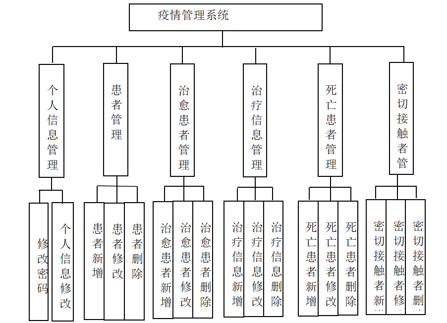

#### 系统流程分析

操作流程分析

程序上交给用户进行使用时，需要提供程序的操作流程图，这样便于用户容易理解程序的具体工作步骤，现如今程序的操作流程都有一个大致的标准，即先通过登录页面提交登录数据，通过程序验证正确之后，用户才能在程序功能操作区页面操作对应的功能。

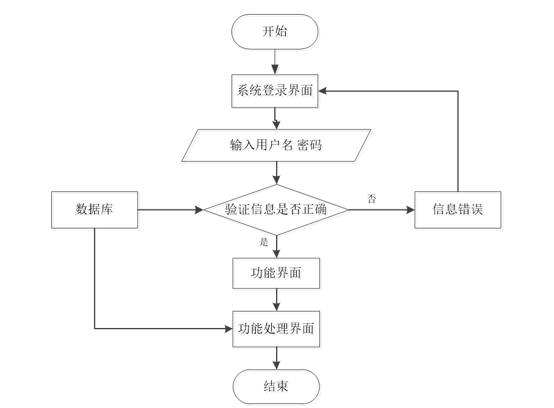

登录流程分析

在这个部分，需要对程序的登录功能模块的运行流程，进行单独说明。程序设置登录模块也是为了安全起见，让用户使用放心，登录模块主要就是让用户提交登录信息，程序进行数据验证，验证通过的用户才能够成功登录程序。

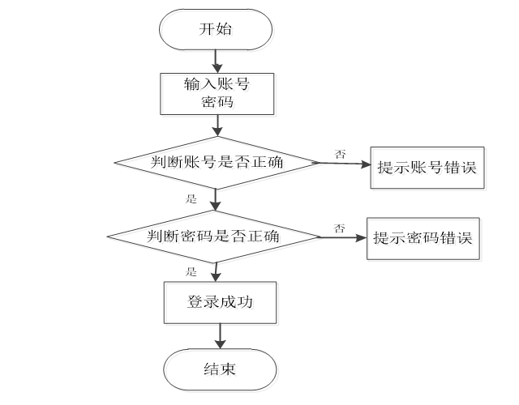

信息添加流程分析

程序的添加功能就是提供给操作者录入信息的功能，不管是涉及到用户信息添加，还是其它功能模块涉及到的信息添加，程序的信息添加流程都是一致的。程序都是先对操作者录入的数据进行判定，这个判定规则是一段提前编写完成的程序代码，当程序判定数据符合要求时，才会把操作者录入的数据登记在数据表里面，比如添加的用户信息，就会把新添加的用户信息写入用户信息的数据表文件里面。

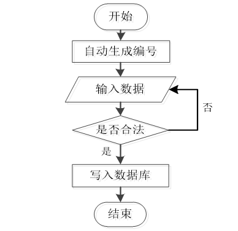

信息删除流程分析

当从程序里面删除某种无效数据时，遵循程序的信息删除流程，先要选中操作者需要删除的数据，程序为了预防操作者误删信息，也会进行提示，当操作者真正确定要删选中的信息时，该信息就会从数据库中被永久删除。

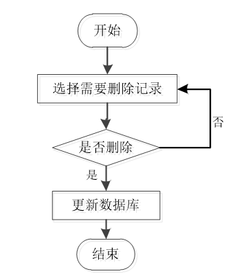

#### 系统作用

基于Spring Boot搭建的疫情管理系统在现代公共卫生管理中发挥了重要作用：

提升疫情管理效率：通过信息化手段，实现疫情信息的实时录入、更新和统计，大大提高了疫情管理的效率。  
确保数据准确性：系统通过标准化的数据录入和管理流程，确保疫情数据的准确性和一致性，为决策提供可靠依据。  
增强监控能力：系统提供了对患者和密切接触者的全面监控功能，帮助公共卫生部门及时发现和应对疫情风险。  
便于信息共享：系统通过模块化设计，实现了不同角色之间的信息共享和协作，提升了疫情管理的整体效能。  
提高安全性：系统通过权限管理和数据加密等技术手段，确保疫情信息的安全性和隐私保护。  

#### 系统功能截图

登录

治疗信息

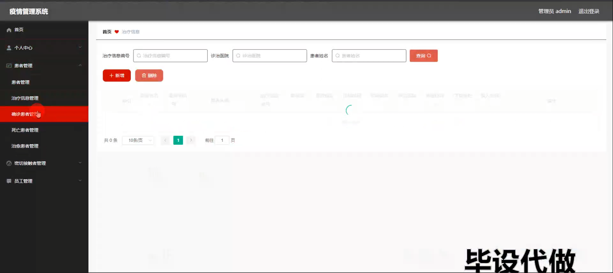

患者信息管理

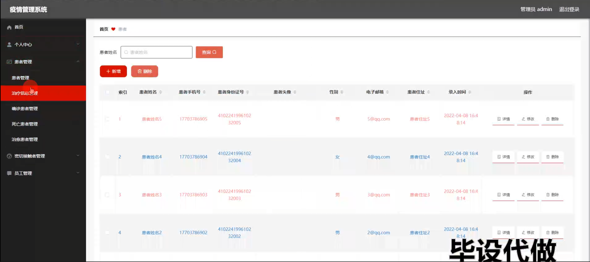

死亡患者管理

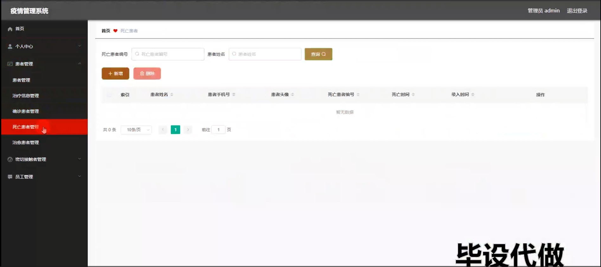

治愈患者管理

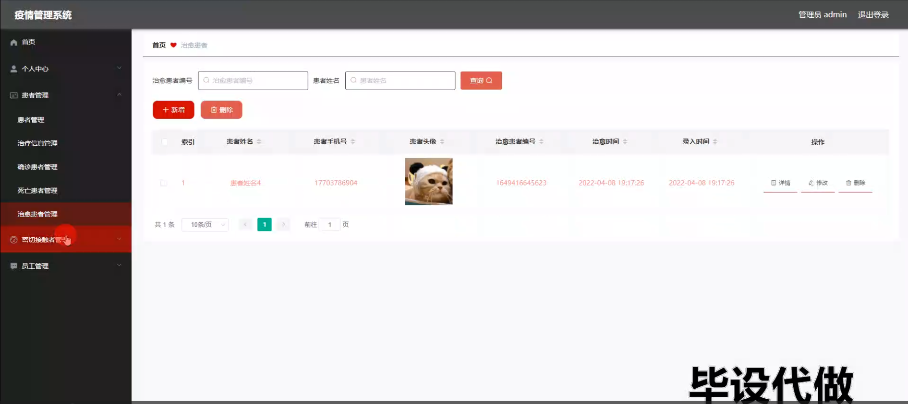

密切接触者管理

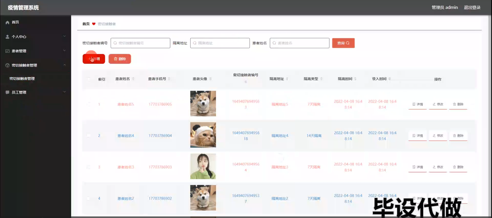

员工管理

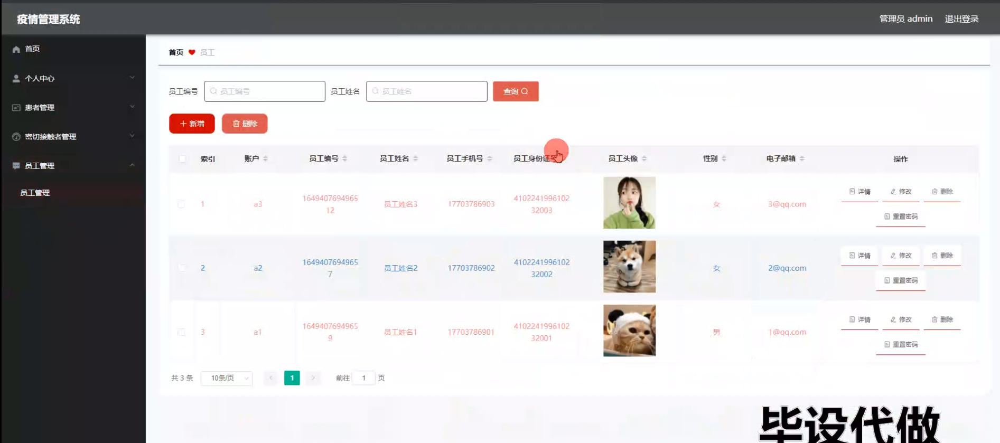

员工端个人信息

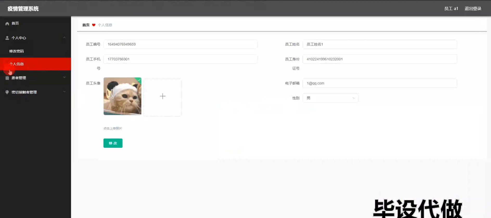

确诊患者管理

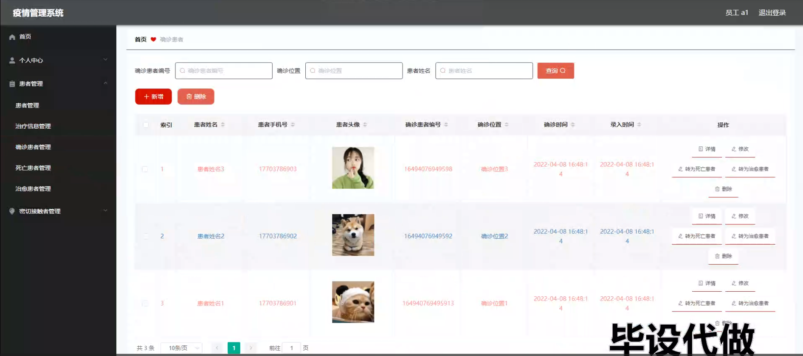

#### 总结

基于Spring Boot搭建的疫情管理系统通过全面的功能模块设计，实现了对疫情信息的高效管理和实时监控，为现代公共卫生管理提供了强有力的技术支持。系统在提高疫情管理效率、确保数据准确性和增强监控能力方面发挥了重要作用。然而，在实际应用中，系统可能还面临着扩展性和用户体验方面的挑战。未来，可以结合更多的智能技术，如大数据分析和人工智能，进一步提升系统的功能和性能，确保在应对各种突发公共卫生事件时，能够快速、准确、高效地进行管理和决策。通过不断的优化和升级，基于Spring Boot的疫情管理系统将为公共卫生管理的发展提供更加坚实的保障。

#### 使用说明

创建数据库，执行数据库脚本 修改jdbc数据库连接参数 下载安装maven依赖jar 启动idea中的springboot项目

后台登录页面
http://localhost:8080/yiqingxinxiguanlixitong/admin/dist/index.html

管理员				账户:admin 		密码：admin

员工				账户:a1 		密码：123456
